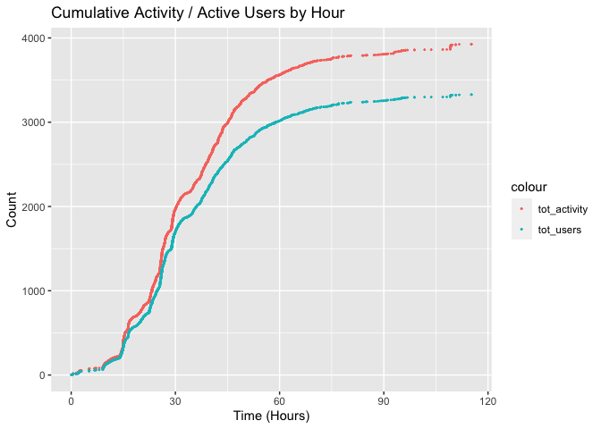

Hoaxy Data Pipeline
================

The following document describes an automated workflow for the following
tasks:

1.  Collect Tweet data from Hoaxy
2.  Enrich Twitter user accounts with profile information
3.  Generate time series data for us in Vensim

## Load libraries and functions

``` r
library(tidyverse)
library(stringr)
library(hoaxy)
library(RColorBrewer)
library(scales)
source("~/Documents/hoaxy/functions.R")
hoaxy_key('2b584e8cdcmshd9e59585deed9d6p114a43jsn73cc6214f62d')
```

## Query Hoaxy for recent articles

``` r
articles <- hx_latest_articles(past_hours = 30)
articles$tag <- extract_misinfo_tags(articles)
```

## Filter article list for likely misinformation stories

``` r
misinfo_tags <- c("clickbait", "conspiracy", "junksci", 
                  "junkscience", "hoax", "fake")
articles <- articles %>% filter(tag %in% misinfo_tags)
articles$tag %>% table()
```

    ## .
    ##  clickbait conspiracy       hoax 
    ##        319        199         14

## Query articles for Hoaxy edges

Print sample headlines categorized as conspiracies.

``` r
articles <- articles %>% filter(tag == "conspiracy")
articles$title[1:10]
```

    ##  [1] "PizzaGate Is the Silver Bullet! Exposed as CIA Global Pedo-Operation! | Alternative"                                                          
    ##  [2] "US Just Admitted \"ISIS HQ\" They Blew Up Was Actually an Innocent Family's Home"                                                             
    ##  [3] "BREAKING – The fight for America begins: Trump to invoke Insurrection Act that authorizes National Guard, military action inside U.S. borders"
    ##  [4] "Daily Gun Deals: CMMG AR15 22LR Bravo Rifle Conversion Kit +3 Mags $219.95 FREE S&H"                                                          
    ##  [5] "Major Hollywood Pedophile Ring Bust"                                                                                                          
    ##  [6] "Trump Win Validated by Quantum Blockchain System Recount of Votes | Politics"                                                                 
    ##  [7] "Money Spent by Both Parties in 2020 Election Could've Nearly Ended Homelessness in US"                                                        
    ##  [8] "Boom! Tucker's Brilliant Summation! How Is He Still On Fox After He Ripped Their Guts Out?! Must Watch! | Politics"                           
    ##  [9] "X22Report: The Deep State/MSM Start To Shift Their Narrative, Dark Winter, The World Is Watching!"                                            
    ## [10] "Vaccines - The Oldest Scam"

Query Hoaxy for edges

``` r
edges <- list()
for (i in 1:10){
edges[[i]] <- hx_edges(articles$id[i], nodes_limit = 50000)
print(paste0("Query ", i, " complete: ", nrow(edges[[i]]), " records"))
}
```

    ## [1] "Query 1 complete: 184 records"
    ## [1] "Query 2 complete: 114 records"
    ## [1] "Query 3 complete: 8 records"
    ## [1] "Query 4 complete: 1 records"
    ## [1] "Query 5 complete: 166 records"
    ## [1] "Query 6 complete: 3924 records"
    ## [1] "Query 7 complete: 10 records"
    ## [1] "Query 8 complete: 0 records"
    ## [1] "Query 9 complete: 4 records"
    ## [1] "Query 10 complete: 0 records"

The story with the most tweet activity
    was:

``` r
articles$title[edges %>% lapply(nrow) %>% unlist() %>% which.max()]
```

    ## [1] "Trump Win Validated by Quantum Blockchain System Recount of Votes | Politics"

## Hoaxy edge data

List column
names

``` r
top_article <- edges[[edges %>% lapply(nrow) %>% unlist() %>% which.max()]]
top_article <- top_article %>% as_tibble()
top_article %>% colnames()
```

    ##  [1] "canonical_url"         "date_published"        "domain"               
    ##  [4] "from_user_id"          "from_user_screen_name" "id"                   
    ##  [7] "is_mention"            "site_type"             "title"                
    ## [10] "to_user_id"            "to_user_screen_name"   "tweet_created_at"     
    ## [13] "tweet_id"              "tweet_type"            "url_id"

Count tweet activity by type

``` r
top_article %>% count(tweet_type)
```

    ## # A tibble: 4 x 2
    ##   tweet_type     n
    ##   <chr>      <int>
    ## 1 origin       138
    ## 2 quote        486
    ## 3 reply       1612
    ## 4 retweet     1688

Plot tweet activty by date and time

``` r
top_article <- top_article %>% 
  mutate(tweet_created_at = tweet_created_at %>% 
           as.POSIXct(format = "%Y-%m-%dT%H:%M:%S.000Z"))

ggplot(data = top_article,
         mapping = aes(x = tweet_created_at,
                       y = tweet_type)) +
    geom_jitter(size = 0.2) + 
    scale_x_datetime(breaks=date_breaks("24 hour"), labels=date_format("%m-%d")) +
    labs(title = top_article$title[1],
         x = "Tweet Created At",
         y = "Tweet Type")
```

<!-- -->

## Parse time series data

Caculate differences between time of activity and time of first
activity.

``` r
top_article <- top_article %>% 
    mutate(h_hour = min(tweet_created_at)) %>%
    mutate(h = as.numeric(difftime(tweet_created_at, h_hour), units = "hours"))
```

Plot cumulative tweet activity and active users over time

  - Activity: number of tweet `created_at` time stamps \<= t
  - Active User: count of unique users who have posted before time t

<!-- end list -->

``` r
time_increments <- top_article$h %>% unique() %>% sort()

activity_by_hour <- tibble(t = time_increments, 
                           tot_activity = NA,
                           tot_users = NA)

for (i in 1:length(time_increments)){
  activity_by_hour$tot_activity[i] = sum(top_article$h <= time_increments[i])
  activity_by_hour$tot_users[i] = 
    c(top_article$from_user_id[top_article$h <= time_increments[i]],
      top_article$to_user_id[top_article$h <= time_increments[i]]) %>%
    unique() %>% length()
  }

ggplot(data = activity_by_hour,
         mapping = aes(x = t, y = tot_activity)) +
  geom_point(size = 0.25, aes(color = "tot_activity")) + 
  geom_point(data = activity_by_hour,
             mapping = aes(x = t, y = tot_users,
                           color = "tot_users"),
             size = 0.25) +
  labs(title = "Cumulative Activity / Active Users by Hour",
       x = "Time (Hours)",
       y = "Count") 
```

<!-- -->

## Generate Vensim lookup variable text string

Round time values to integers and average counts for each period

``` r
vensim_data <- activity_by_hour %>%
  mutate(t = t %>% ceiling()) %>%
  group_by(t) %>% 
  summarise(tot_users = tot_users %>% mean() %>% ceiling())

N <- nrow(vensim_data)
vensim_data$change <- c(0,
      vensim_data$tot_users[2:N] - vensim_data$tot_users[1:(N-1)])
vensim_data %>% head()
```

    ## # A tibble: 6 x 3
    ##       t tot_users change
    ##   <dbl>     <dbl>  <dbl>
    ## 1     0         2      0
    ## 2     1        10      8
    ## 3     2        17      7
    ## 4     3        32     15
    ## 5     6        51     19
    ## 6     7        58      7

Generate lookup table string where each value represents

``` r
vensim_string <- c()
for (i in 1:nrow(vensim_data)){
  vensim_string[i] <- paste0("(", vensim_data$t[i], ", ", 
                             vensim_data$change[i], ")")}

vensim_string <- c(vensim_string[-length(vensim_string)])
vensim_string <- vensim_string %>% paste0(collapse = ", ")
vensim_string
```

    ## [1] "(0, 0), (1, 8), (2, 7), (3, 15), (6, 19), (7, 7), (8, 2), (9, 1), (10, 34), (11, 43), (12, 26), (13, 19), (14, 16), (15, 71), (16, 109), (17, 106), (18, 68), (19, 28), (20, 34), (21, 54), (22, 48), (23, 68), (24, 100), (25, 86), (26, 141), (27, 175), (28, 138), (29, 80), (30, 115), (31, 125), (32, 68), (33, 39), (34, 24), (35, 30), (36, 56), (37, 52), (38, 59), (39, 75), (40, 75), (41, 77), (42, 63), (43, 60), (44, 52), (45, 44), (46, 49), (47, 67), (48, 48), (49, 34), (50, 28), (51, 34), (52, 34), (53, 32), (54, 32), (55, 32), (56, 23), (57, 19), (58, 25), (59, 16), (60, 20), (61, 17), (62, 19), (63, 16), (64, 15), (65, 12), (66, 13), (67, 15), (68, 13), (69, 16), (70, 12), (71, 10), (72, 6), (73, 6), (74, 3), (75, 9), (76, 10), (77, 8), (78, 10), (79, 3), (80, 3), (81, 6), (84, 4), (85, 3), (86, 2), (88, 3), (89, 4), (90, 5), (91, 5), (92, 2), (93, 5), (94, 5), (95, 6), (96, 9), (97, 5), (99, 4), (102, 2), (104, 0), (107, 1), (109, 1), (110, 12), (111, 11)"
